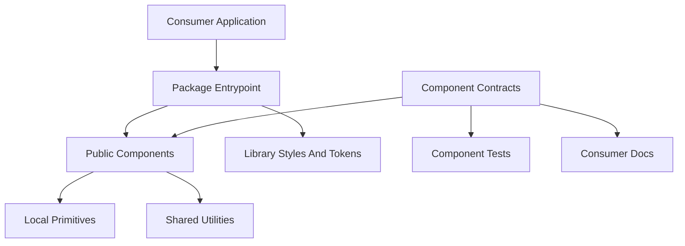

# Component Library Architecture

## Purpose

This document describes the developer-facing architecture of a reusable React component library. It focuses on runtime design, module boundaries, and public API behavior, not repository workflows or release process details.

## Architectural Principles

- Keep components presentational and domain-neutral.
- Push product behavior to integration layers through props and callbacks.
- Expose stable, typed public APIs.
- Prefer composition over inheritance.
- Keep modules side-effect free by default for better tree-shaking.

## Layered Model

## Runtime Boundaries

### Public Surface

- The package entrypoint exports intentionally supported components, types, and utilities.
- Consumers interact only with documented exports and props.

### Component Modules

- Each component owns its rendering logic, public prop types, and interaction behavior.
- Components should not import host application state, routing, auth, or business services.

### Primitive Composition Layer

- Components are built from accessible, low-level UI primitives.
- Primitive wrappers remain implementation details unless explicitly exported.

### Utility Layer

- Shared helpers stay pure and framework-agnostic where possible.
- Utilities should support component behavior without becoming domain service layers.

### Style And Token Layer

- Styles rely on semantic tokens and predictable class composition.
- Token names should be namespaced to reduce collisions in host applications.
- Theme changes should be possible without changing component APIs.

## API Design Model

- Use explicit TypeScript props for all public components.
- Favor additive, composable props over tightly coupled configuration objects.
- Model access and policy behavior through injectable contracts (for example, required capabilities plus resolver callbacks).
- Keep uncontrolled and controlled usage patterns clear when both are supported.

## Contract-Driven Development Model

- Define component behavior in machine-readable contracts.
- Keep implementation, tests, and docs aligned with contract states.
- Treat contracts as executable architecture rules for behavior, accessibility, and interaction guarantees.

## Accessibility Architecture

- Interactive components must provide keyboard support and visible focus behavior.
- Inputs and form controls must preserve correct labeling and aria state.
- Overlay and popover-like interactions must provide predictable focus management and dismissal behavior.

## Packaging Architecture

- Publish ESM output with declaration files for consumer type safety.
- Keep exports intentional so consumers can import stable entrypoints.
- Ensure package styles and optional themes can be consumed independently.

## What Is Out Of Scope Here

This architecture document intentionally excludes:

- repository-specific folder enforcement rules
- CI workflow definitions and pipeline commands
- release checklist steps and team process policies
- local tooling and script orchestration details

Those concerns belong in contribution and operations documentation.
